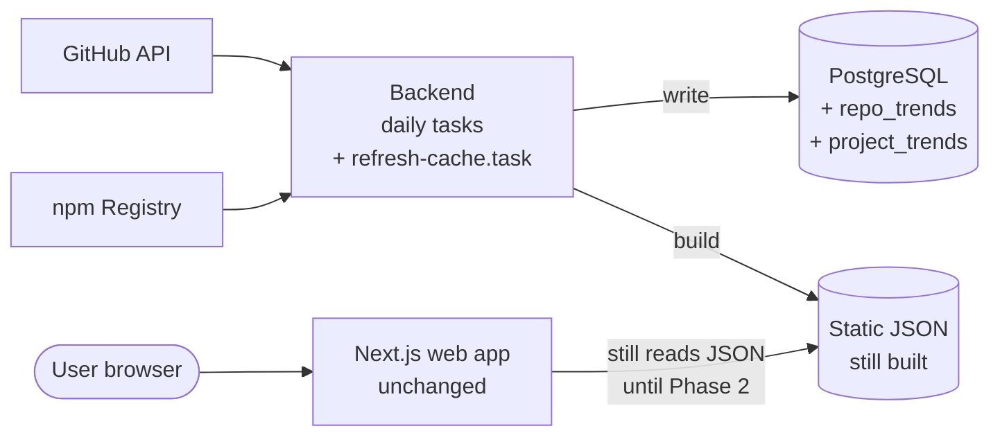
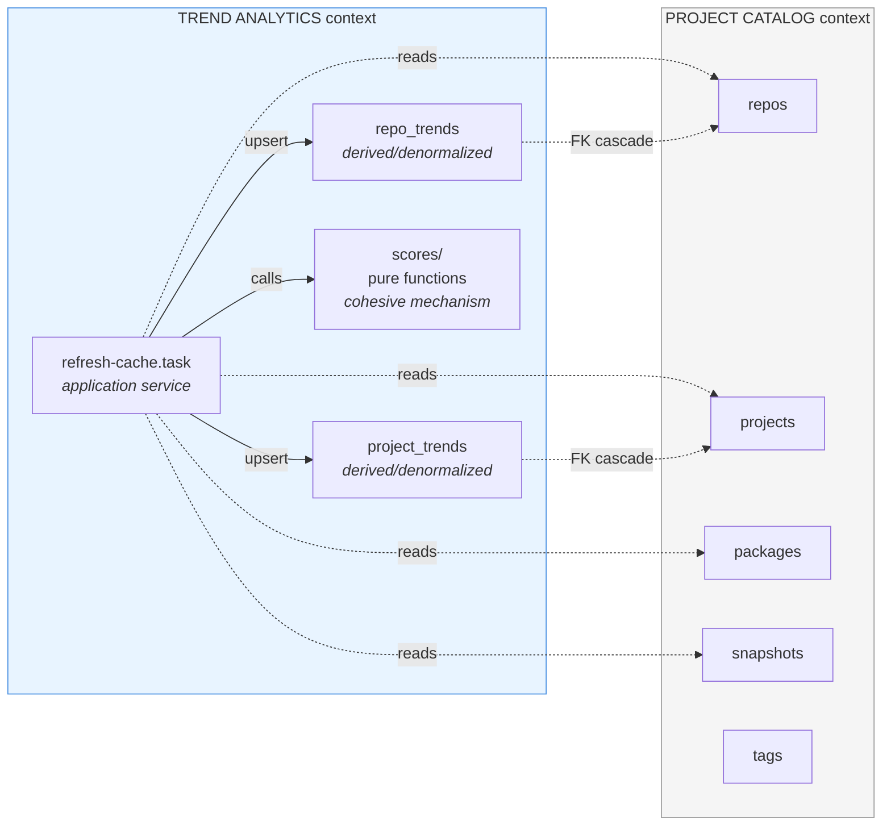
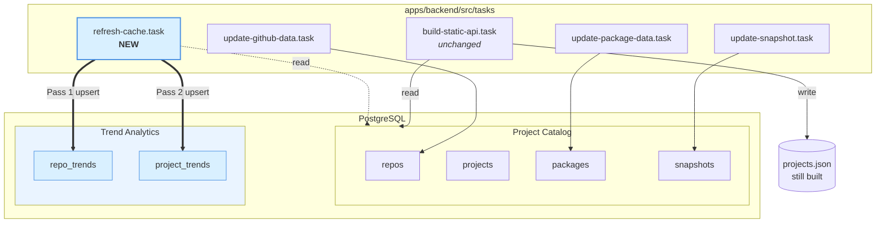
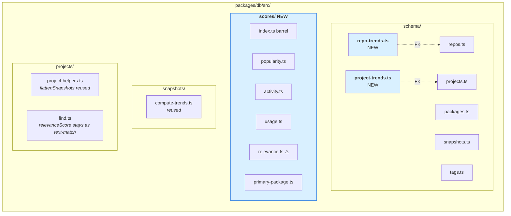
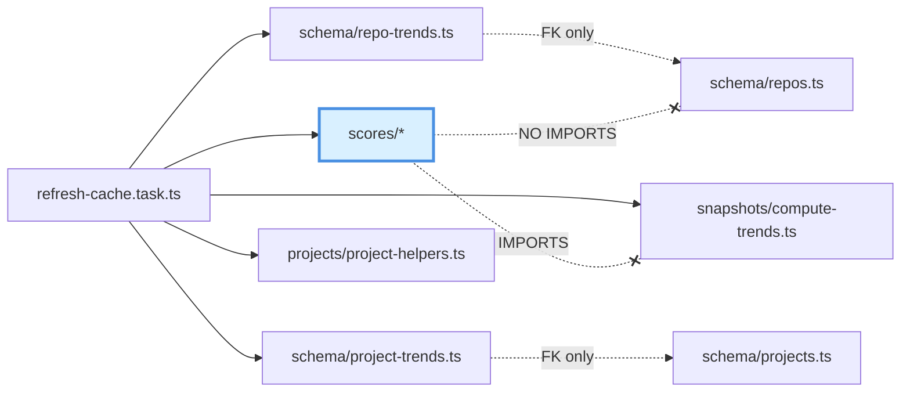
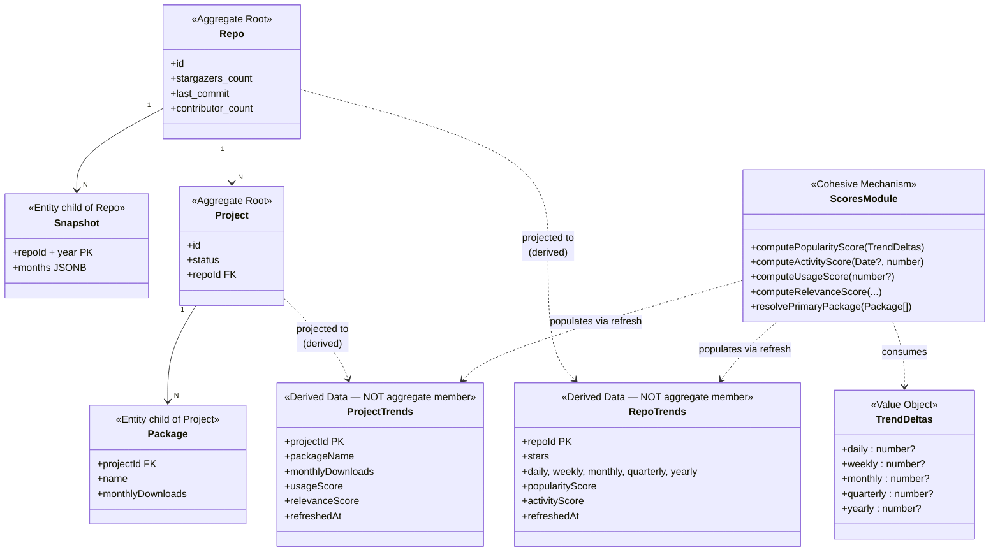
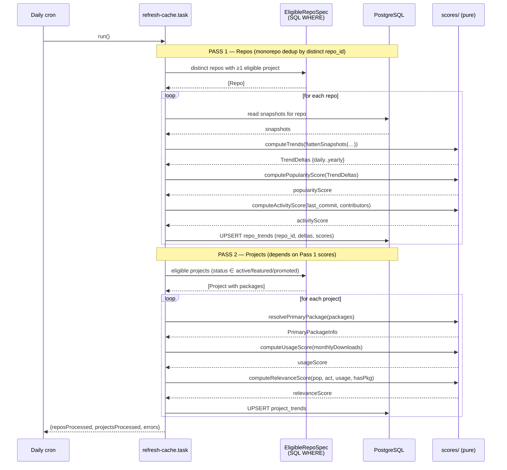
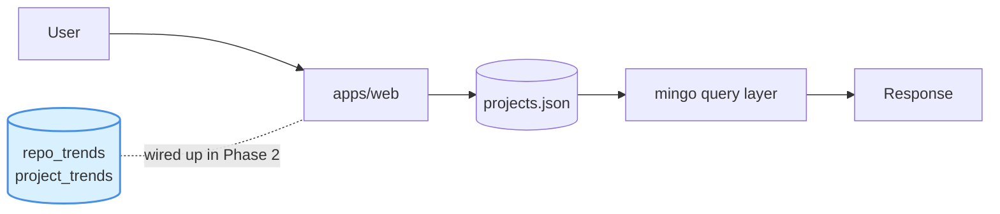

# Architecture — After Phase 1

Phase 1 adds **two cache tables**, a **pure scoring module**, and a **daily refresh task**. The web-app read path is unchanged — it still reads JSON. The cache tables exist and are populated but nothing queries them yet. Phase 2 will wire the read path.

## 1. System context (unchanged at level 1)

## 2. Bounded contexts (new in Phase 1)

**Relationship:** Shared Kernel (same PostgreSQL database). Trend Analytics is a **downstream consumer** — it only reads from Project Catalog. Cache rows are **derived, denormalized data** owned exclusively by Trend Analytics.

## 3. Container view — backend daily tasks

## 4. Module layout — `packages/db/src/`

`scores/` is a **leaf**. The dashed red line below shows forbidden imports — no arrow from `scores/*` into anything else in the project.

## 5. Domain model — with derived data boundary

## 6. Refresh task — two-pass sequence

## 7. Read path — unchanged in Phase 1

The cache tables exist, are populated, are indexed, and are untouched by any consumer. That is the Phase 1 finish line.
