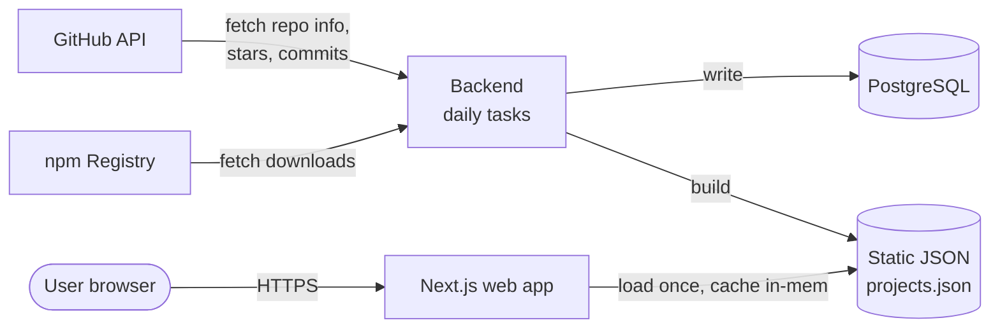
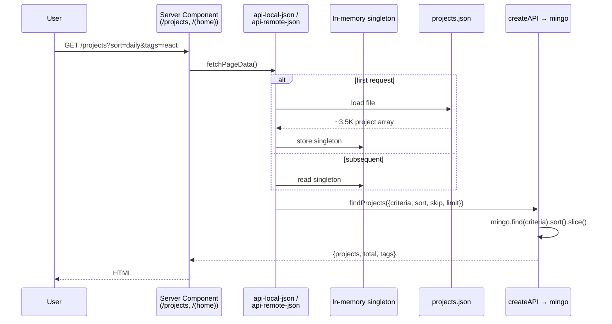
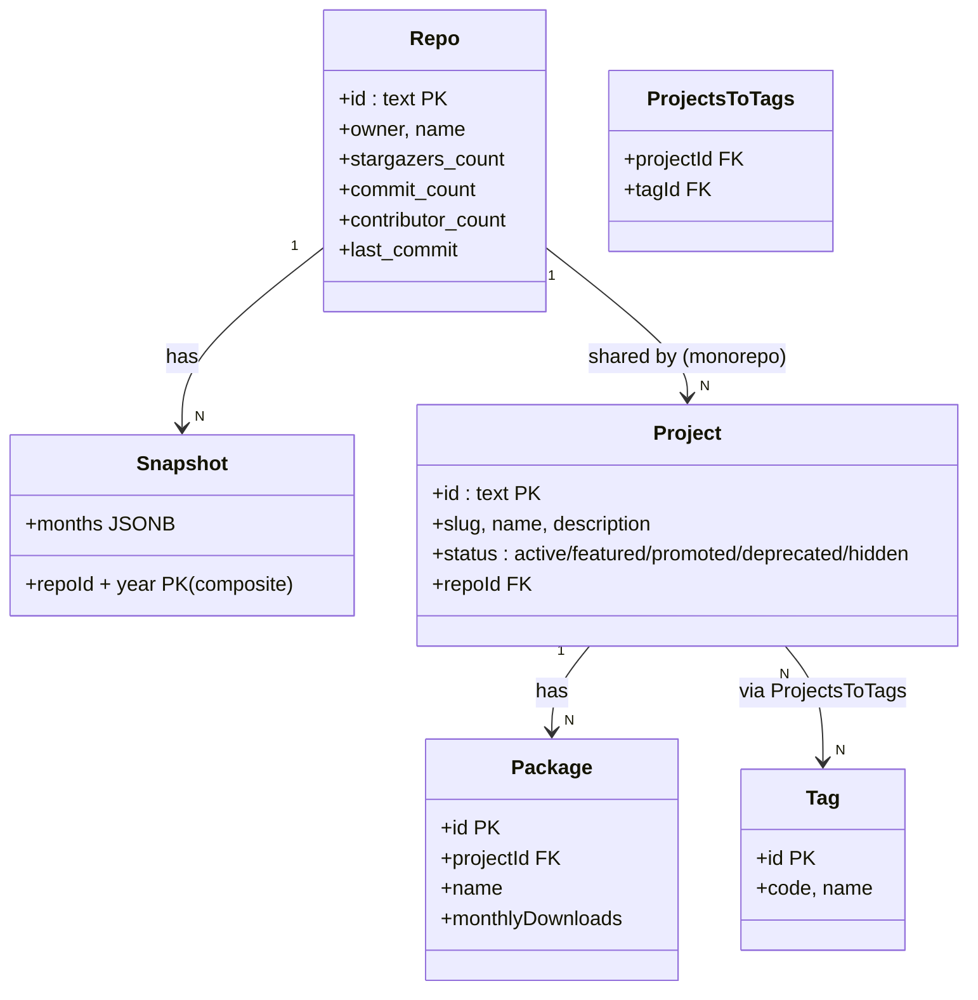
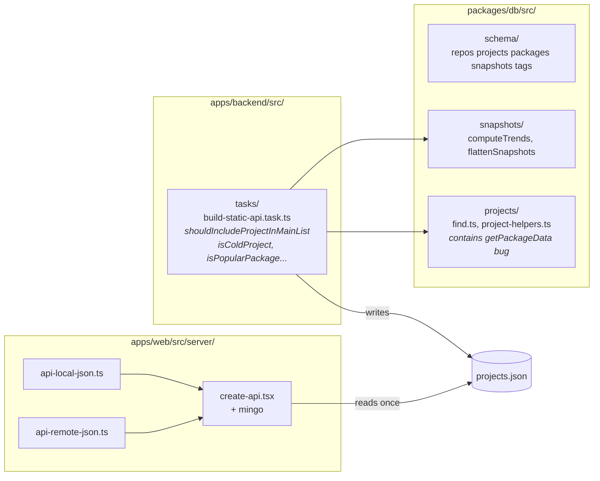

# Architecture — Current (before Phase 1)

The system today has **no cache layer**. Every listing request reads a daily-built static JSON file into memory and runs mingo (MongoDB-query-compatible) predicates against the array. Trends are computed at JSON-build time, not at query time.

## 1. System context (C4 level 1)



## 2. Container view — backend daily tasks

```mermaid
flowchart TB
  subgraph Backend[apps/backend/src/tasks]
    UG[update-github-data.task]
    UN[update-package-data.task]
    US[update-snapshot.task]
    BSA[build-static-api.task]
  end

  subgraph DB[(PostgreSQL)]
    REPOS[repos]
    PROJS[projects]
    PKGS[packages]
    SNAPS[snapshots]
    TAGS[tags]
  end

  JSON[(projects.json<br/>projects-full.json)]

  UG --> REPOS
  UN --> PKGS
  US --> SNAPS

  BSA -->|read| REPOS
  BSA -->|read| PROJS
  BSA -->|read| PKGS
  BSA -->|read| SNAPS
  BSA -->|read| TAGS
  BSA -->|computeTrends per repo<br/>at build time| BSA
  BSA -->|write| JSON
```

## 3. Read path — web request



## 4. Domain concepts already in the code



## 5. Where the work lives today



## 6. Pain points this architecture creates

| Pain | Where it shows up |
|---|---|
| Every request loads the full ~3.5K project array into memory | `api-local-json.ts`, `api-remote-json.ts` |
| Sort/filter pushed through mingo — no DB index use | `create-api.tsx` → `api-projects.tsx` |
| Trend computation is tied to JSON build time — can't recompute without rebuilding JSON | `build-static-api.task.ts` → `computeTrends` |
| "Primary package" is implicitly `packages[0]` (array order), not max-downloads | `project-helpers.ts:71` `getPackageData` |
| Eligibility predicates are scattered ad-hoc `is*` functions, not a named Specification | `build-static-api.task.ts` `isCold*/isInactive*/isPromoted*/isFeatured*` |
| `relevanceScore` means "text-match rank" in `find.ts:168` — will collide with Phase 1's quality-floor meaning | `packages/db/src/projects/find.ts` |
