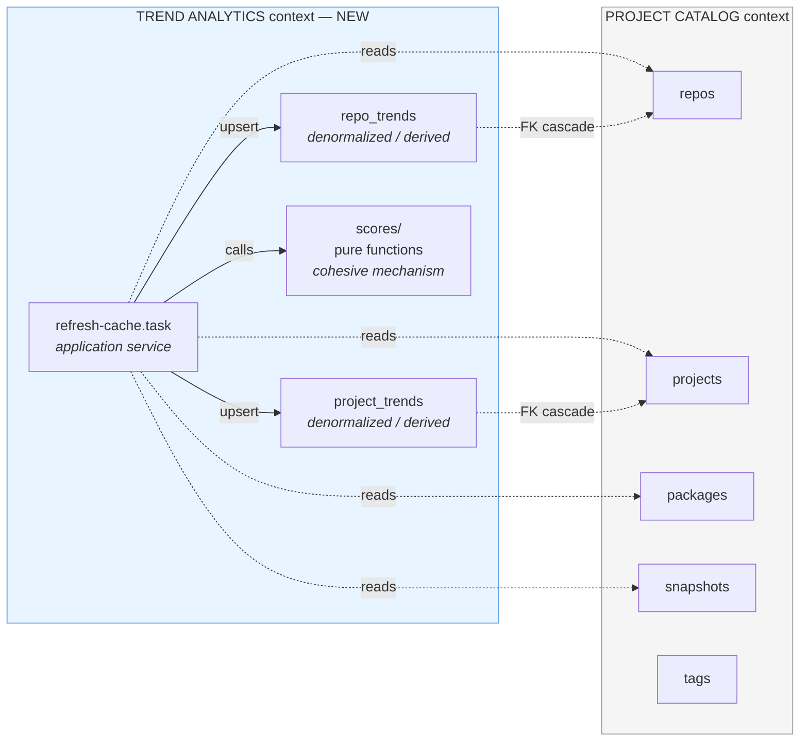
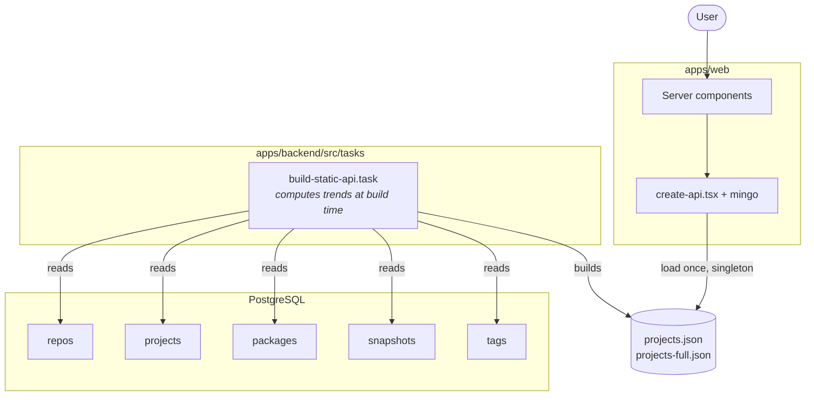
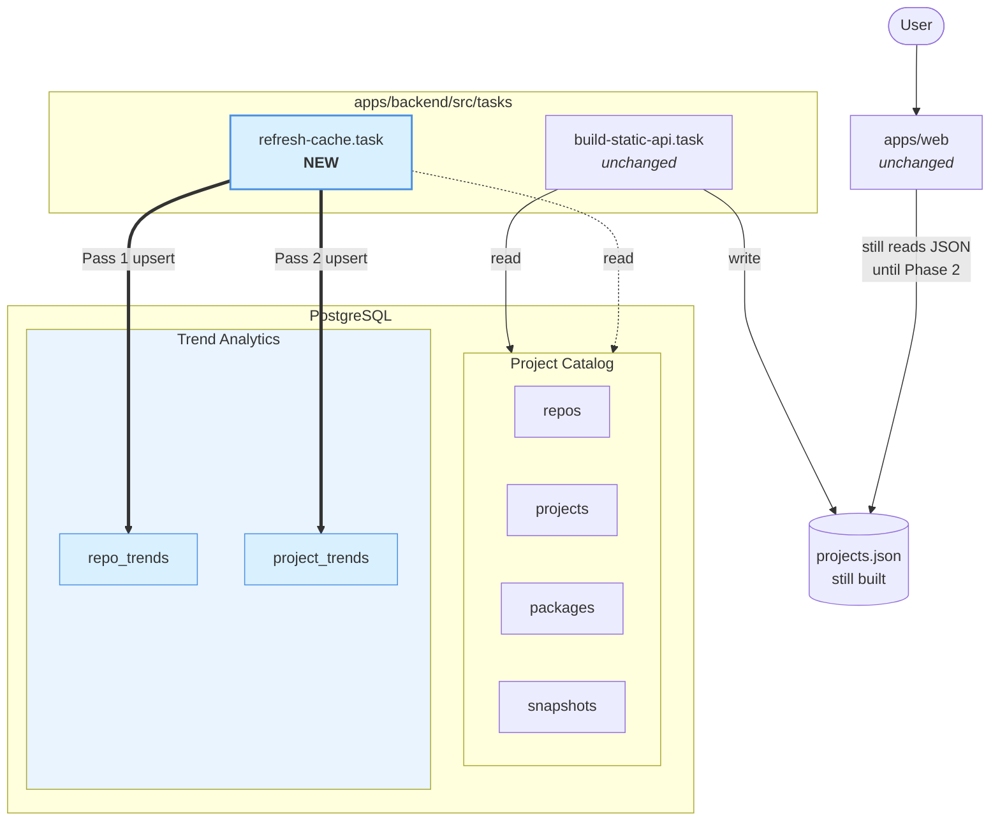
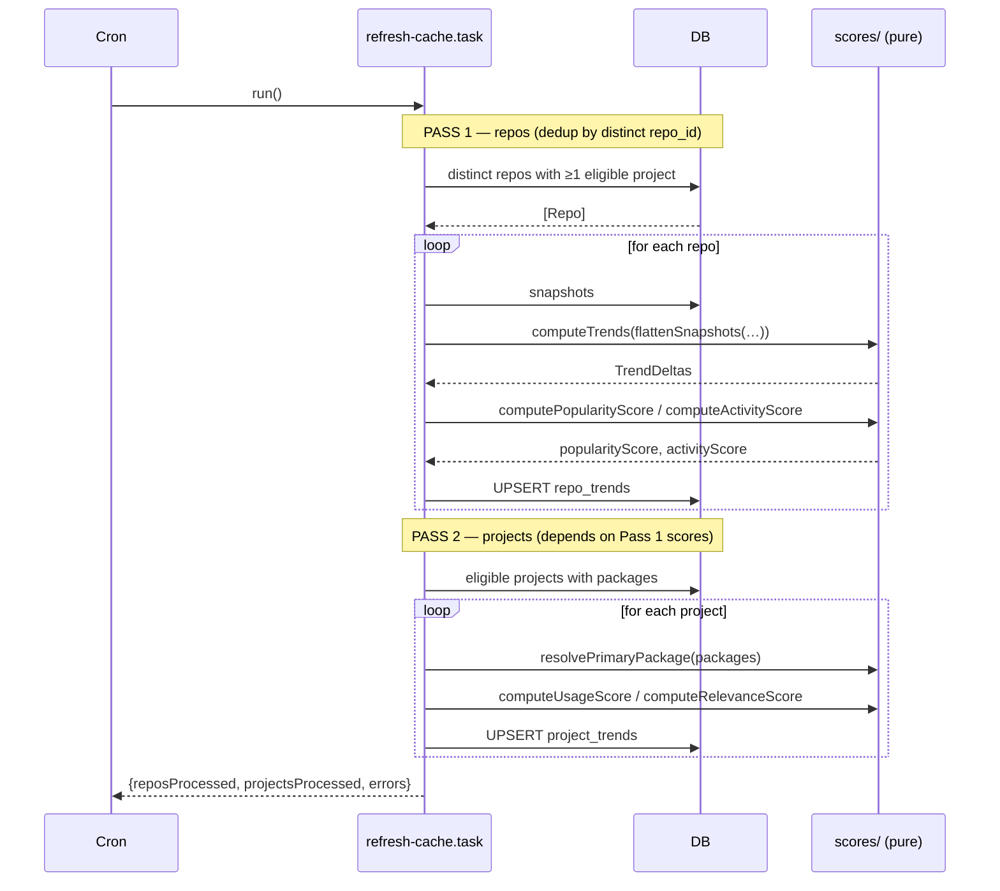

# Phase 1 — Cache Foundation

**Branch:** `issue-371-static-api-to-database-queries`
**Goal of Phase 1:** land a denormalized, daily-refreshed cache layer (`repo_trends`, `project_trends`) and a pure, leaf-node scoring module so that Phase 2+ can replace the mingo-on-static-JSON read path with real Drizzle queries.
**PR invariant:** *after this PR, the system behaves identically to before. The database has two new populated tables. Nothing reads them yet.*

---

## Table of contents

1. [What this PR changes in one breath](#1-what-this-pr-changes-in-one-breath)
2. [Bounded contexts](#2-bounded-contexts)
3. [Module catalog — existing (touched but unchanged)](#3-module-catalog--existing-touched-but-unchanged)
4. [Module catalog — new in Phase 1](#4-module-catalog--new-in-phase-1)
5. [Architecture — before and after](#5-architecture--before-and-after)
6. [Domain concepts → modules → plans](#6-domain-concepts--modules--plans)
7. [Type-flow evidence — why the boundary is clean](#7-type-flow-evidence--why-the-boundary-is-clean)
8. [Evans refinements (applied to design docs)](#8-evans-refinements-applied-to-design-docs)
9. [Review checklist](#9-review-checklist)
10. [Appendices](#10-appendices)

---

## 1. What this PR changes in one breath

Four execution plans under `.planning/phases/01-cache-foundation/`:

| Plan | Wave | Files modified | What it lands |
|---|---|---|---|
| [`01-01`](../../phases/01-cache-foundation/01-01-PLAN.md) | 1 | `packages/db/src/schema/{repo-trends,project-trends,index}.ts` | Two Drizzle schema files for cache tables + barrel re-export |
| [`01-02`](../../phases/01-cache-foundation/01-02-PLAN.md) (TDD) | 1 | `packages/db/src/scores/{popularity,activity,usage,relevance,primary-package,index}.ts` + `.test.ts` siblings | Pure, zero-dependency scoring Cohesive Mechanism with colocated `bun:test` |
| [`01-03`](../../phases/01-cache-foundation/01-03-PLAN.md) | 2 | `apps/backend/src/tasks/refresh-cache.task.ts`, `apps/backend/src/cli.ts` | Application Service (two-pass orchestrator) + task registration |
| [`01-04`](../../phases/01-cache-foundation/01-04-PLAN.md) | 2 | `packages/db/package.json` | `"./scores"` export path so the backend can import without pulling Drizzle |

**Waves run in parallel where dependencies allow:** 01-01 and 01-02 are independent (schema doesn't import scores; scores doesn't import schema). 01-03 depends on both. 01-04 depends only on 01-02.

---

## 2. Bounded contexts

Phase 1 formalises two contexts that already exist implicitly. They share one PostgreSQL database — a **Shared Kernel** in Evans's vocabulary.



- **Project Catalog** owns: `repos`, `projects`, `packages`, `snapshots`, `tags`. No schema changes in Phase 1.
- **Trend Analytics** owns: `repo_trends`, `project_trends`, `scores/`, `refresh-cache.task.ts`. Entirely new.
- **Relationship:** Trend Analytics is a **downstream consumer** — it reads from Project Catalog and writes only to its own tables. Cache rows are **denormalized, derived data** (Evans) owned exclusively by Trend Analytics. They are **not aggregate members** of Repo or Project — that boundary is the single most important design claim in the DDD doc, and it is the reason cache staleness doesn't break aggregate invariants.

Full context-mapping rationale: [`DDD-DESIGN.md §1`](../2-ddd-designs-for-phase-1-cache-foundation/DDD-DESIGN.md).

---

## 3. Module catalog — existing (touched but unchanged)

These modules are read, reused, or referenced by Phase 1 but not modified. Each row has been verified against the current codebase via ontomics (`describe_file`, `query_concept`).

| Module | Symbols Phase 1 relies on | What Phase 1 does with it | Convention tags |
|---|---|---|---|
| `packages/db/src/schema/repos.ts` | `repos` table, `name_owner_index` | FK target for `repo_trends.repo_id` with `ON DELETE CASCADE` | schema (Drizzle pgTable) |
| `packages/db/src/schema/projects.ts` | `projects` table, `status` column | FK target for `project_trends.project_id`; eligibility filtered by `status IN (…)` | schema |
| `packages/db/src/schema/packages.ts` | `packages` table, `monthlyDownloads` | Read by refresh task for primary-package resolution | schema |
| `packages/db/src/schema/snapshots.ts` | `snapshots` table (composite PK `(repoId, year)`, JSONB `months`) | Read by refresh task Pass 1 | schema |
| `packages/db/src/snapshots/compute-trends.ts` | `computeTrends(Snapshot[], Date)` — already produces `{daily, weekly, monthly, quarterly, yearly}` | **Reused verbatim.** Output shape is the `TrendDeltas` value object Phase 1 names | `trends function`, internal helpers `findSnapshotDaysAgo`, `getDelta`, `getDailyDelta`, `diffDay`, `toDate` |
| `packages/db/src/projects/project-helpers.ts` | `flattenSnapshots(OneYearSnapshots[]) → Snapshot[]` | Reused by refresh task to feed `computeTrends` | accessor |
| `packages/db/src/constants.ts` | `PROJECT_STATUSES` | Used by `EligibleProjectSpecification` via `inArray(projects.status, […])` | constants |
| `apps/backend/src/task-runner/*` | `createTask`, `createTaskContext` | `refresh-cache.task.ts` is wrapped with `createTask()` matching existing tasks | task infrastructure |

⚠ **`packages/db/src/projects/project-helpers.ts` is a grab-bag** — `describe_file` shows it houses 13 unrelated functions including the buggy `getPackageData` (`packages[0]` instead of max downloads) and `flattenSnapshots`. Phase 1 doesn't touch this file; Phase 2 will revisit it when the listing query module needs a correct primary-package resolver.

⚠ **`packages/db/src/projects/find.ts` contains the `relevanceScore` false cognate** (line 168 — local `sql` fragment for text-search rank). Phase 1 documents this collision but does **not** rename it — the rename belongs to the Phase 2 atomic change set that actually touches this query path. See [§9.2](#92-false-cognate-relevancescore-vs-relevance_score).

---

## 4. Module catalog — new in Phase 1

These modules do not exist on `develop`. The table gives the exact contract each new file commits to.

### 4.1 `packages/db/src/schema/repo-trends.ts` (Plan 01-01)

| Field | Contract |
|---|---|
| **Purpose** | Denormalized per-repo cache row: stars, 5 trend deltas, `popularityScore`, `activityScore`, `refreshedAt` |
| **Exports** | `repoTrends` (pgTable), `repoTrendsRelations` |
| **Imports** | `drizzle-orm`, `drizzle-orm/pg-core`, `./repos` (FK reference only) |
| **Forbidden imports** | `../scores/*`, `../snapshots/*`, `../projects/*`, `../db`, `./project-trends` |
| **Keyed by** | `repo_id` (PK, FK to `repos.id`, `ON DELETE CASCADE`). **Not by project_id** — monorepo siblings share one row |
| **Indexes** | Descending on every sort column (`popularity_score`, `activity_score`, `daily`, `weekly`, `monthly`, `quarterly`, `yearly`), NULLS LAST for trend deltas |
| **Nullability** | Scores: `NOT NULL DEFAULT 0` (avoids NULL handling in ORDER BY). Trend deltas: **nullable** (NULL = insufficient data; 0 = computed zero change) |

### 4.2 `packages/db/src/schema/project-trends.ts` (Plan 01-01)

| Field | Contract |
|---|---|
| **Purpose** | Denormalized per-project cache row: primary package name, monthly downloads, `usageScore`, `relevanceScore`, `refreshedAt` |
| **Exports** | `projectTrends` (pgTable), `projectTrendsRelations` |
| **Imports** | `drizzle-orm`, `drizzle-orm/pg-core`, `./projects` (FK reference only) |
| **Forbidden imports** | `../scores/*`, `../snapshots/*`, `./repos`, `./repo-trends`, `../db` |
| **Keyed by** | `project_id` (PK, FK to `projects.id`, `ON DELETE CASCADE`) |
| **Indexes** | Descending on score columns |
| **Nullability** | Scores: `NOT NULL DEFAULT 0`. `package_name`/`monthly_downloads`: nullable (no-package projects) |

### 4.3 `packages/db/src/scores/` (Plan 01-02 — TDD)

A **leaf module** — zero project imports. This is the single most important architectural property of Phase 1.

| File | Export | Signature | Policy encoded |
|---|---|---|---|
| `popularity.ts` | `computePopularityScore` | `(trends: TrendDeltas) → number` | Signed log-scale momentum blend |
| `activity.ts` | `computeActivityScore` | `(lastCommit: Date \| null, contributorCount: number, referenceDate?: Date) → number` | 0–100 recency with contributor bonus |
| `usage.ts` | `computeUsageScore` | `(monthlyDownloads: number \| null) → number` | 0–100 log-normalised downloads |
| `relevance.ts` | `computeRelevanceScore` | `(pop, act, usage, hasPackage: boolean) → number` | `RelevanceWeightPolicy` (0.5/0.25/0.25 with package, 0.65/0.35 without) |
| `primary-package.ts` | `resolvePrimaryPackage` | `(packages: PackageInfo[]) → PackageInfo \| null` | `PrimaryPackageSelectionPolicy` = `argmax(monthlyDownloads)` |
| `index.ts` | barrel | — | — |

**New naming conventions this module introduces to the codebase:**
- `compute*(…) → number` — pure scoring functions. Does not yet exist as a convention in `list_conventions` output; Phase 1 will be the first module using it consistently.
- `resolve*(…) → T \| null` — stateless selection/resolution over a collection. Also new.

Both should be added to the house-style notes post-merge so reviewers of later phases know what to expect.

**Forbidden imports (enforced by code review):** `drizzle-orm`, any `../schema/*`, any `../snapshots/*`, any `../projects/*`, any `../db`, any `../constants`. If any of these appear in a `scores/` file, the PR is rejected.

### 4.4 `apps/backend/src/tasks/refresh-cache.task.ts` (Plan 01-03)

| Field | Contract |
|---|---|
| **Purpose** | Application Service — two-pass daily cache population |
| **Exports** | `refreshCacheTask` (wrapped by `createTask()`) |
| **Imports** | `@repo/db` (schema + db), `@repo/db/scores`, `@repo/db/snapshots`, `@repo/db/projects` (`flattenSnapshots`), `@repo/db/constants` (`PROJECT_STATUSES`), `@/task-runner` |
| **Contains no** | score formulas, trend computation, snapshot flattening, schema definitions |
| **Pass 1 (repos)** | `SELECT DISTINCT r.id FROM repos JOIN projects WHERE status ∈ PROJECT_STATUSES` → for each repo: read snapshots → `flattenSnapshots` → `computeTrends` → `computePopularityScore` + `computeActivityScore` → UPSERT `repo_trends`. Keyed by `repo_id` so monorepo siblings produce one row |
| **Pass 2 (projects)** | Read eligible projects with packages → for each: `resolvePrimaryPackage` → `computeUsageScore` → `computeRelevanceScore(pop, act, usage, hasPackage)` → UPSERT `project_trends`. **Depends on Pass 1** (uses an in-memory `Map<repoId, {pop, act}>` built in Pass 1) |
| **Error handling** | Per-item try/catch with logging; continue on failure. Returns `{reposProcessed, projectsProcessed, errors}` |
| **CLI** | Registered in `apps/backend/src/cli.ts` alongside existing tasks |

### 4.5 `packages/db/package.json` (Plan 01-04)

Single new entry: `"./scores": "./src/scores/index.ts"`. Enables `import { computePopularityScore, … } from "@repo/db/scores";` in the backend app without transitively loading Drizzle (since `scores/*` imports nothing from the project).

Nothing else in `package.json` changes.

---

## 5. Architecture — before and after

### 5.1 Data flow — before Phase 1



*Pain points today:* every request loads ~3.5K projects into memory; mingo bypasses DB indexes; trend computation is coupled to the JSON-build task; the `getPackageData` "primary package" bug (`packages[0]` instead of max-downloads) is baked in; eligibility predicates (`isColdProject`, `isInactiveProject`, `isPromotedProject`, `isFeaturedProject`, `isPopularPackage`, `shouldIncludeProjectInMainList`) are scattered in `build-static-api.task.ts`.

Full diagram set (C4 context, module view, sequence diagram, domain model): [`ARCHITECTURE-CURRENT.md`](./ARCHITECTURE-CURRENT.md).

### 5.2 Data flow — after Phase 1



*After Phase 1:* the two cache tables exist, are populated daily, and are indexed. **Nothing reads them yet** — web still loads JSON, mingo still queries it, the old task still runs. That is the Phase 1 finish line.

Full post-Phase-1 diagram set (bounded contexts, module leaf rule, refresh sequence): [`ARCHITECTURE-AFTER.md`](./ARCHITECTURE-AFTER.md).

### 5.3 Refresh task sequence (essential view)



---

## 6. Domain concepts → modules → plans

Every Phase 1 concept, which module owns it, and which plan lands it.

| Concept | Pattern | Module | Symbol | Plan |
|---|---|---|---|---|
| `repo_trends` table + FK cascade | Denormalized derived data | `schema/repo-trends.ts` | `repoTrends`, `repoTrendsRelations` | 01-01 |
| `project_trends` table + FK cascade | Denormalized derived data | `schema/project-trends.ts` | `projectTrends`, `projectTrendsRelations` | 01-01 |
| **TrendDeltas** | Value Object | `scores/popularity.ts` (local type) | structural type for `computePopularityScore` input | 01-02 |
| **RepoScoreSet** | Value Object | Inline in refresh task | `{popularityScore, activityScore}` | 01-03 |
| **ProjectScoreSet** | Value Object | Inline in refresh task | `{usageScore, relevanceScore}` | 01-03 |
| **PrimaryPackageInfo** | Value Object | `scores/primary-package.ts` (local type) | `{name, monthlyDownloads}` | 01-02 |
| Scoring **Cohesive Mechanism** | Evans Cohesive Mechanism | `scores/` | `computePopularityScore`, `computeActivityScore`, `computeUsageScore`, `computeRelevanceScore`, `resolvePrimaryPackage` | 01-02 |
| **EligibleProjectSpecification** | Specification | `refresh-cache.task.ts` | Drizzle `inArray(projects.status, PROJECT_STATUSES)` | 01-03 |
| **EligibleRepoSpecification** | Specification (derived from EligibleProject via ∃) | `refresh-cache.task.ts` | `SELECT DISTINCT r.id FROM repos JOIN projects WHERE …` | 01-03 |
| **RelevanceWeightPolicy** | Policy (named, not extracted) | `scores/relevance.ts` | Hardcoded `0.5/0.25/0.25` vs `0.65/0.35` branch | 01-02 |
| **PrimaryPackageSelectionPolicy** | Policy (named, not extracted) | `scores/primary-package.ts` | `argmax(monthlyDownloads)` | 01-02 |
| **StatusEligibilityPolicy** | Policy (named, not extracted) | Consumed by EligibleProjectSpec | `PROJECT_STATUSES` in `packages/db/src/constants.ts` | (constant already exists) |
| **Monorepo deduplication** | Design property | `refresh-cache.task.ts` Pass 1 | `SELECT DISTINCT r.id` query shape | 01-03 |
| **RefreshCacheTask** | Application Service | `apps/backend/src/tasks/refresh-cache.task.ts` | `refreshCacheTask` | 01-03 |
| **Leaf-module property** | Architectural guarantee | `packages/db/package.json` | `"./scores"` export | 01-04 |

Implicit concepts that Phase 1 makes explicit (see [DDD-DESIGN.md §10](../2-ddd-designs-for-phase-1-cache-foundation/DDD-DESIGN.md)):
- **Refresh Pass** — the two-pass ordering is a domain process. Captured by sequential code + a comment in the task file, not a formal `RefreshSaga` class.
- **Score Staleness** — `refreshedAt` timestamp documents the concern; no formal `StalenessPolicy` until scale requires it.
- **Monorepo Boundary** — handled correctly by schema (`repo_trends` keyed by `repo_id`); not extracted as a `MonorepoGroup` entity.

---

## 7. Type-flow evidence — why the boundary is clean

Ontomics `trace_type(Snapshot)` returns **39 data-flow edges** across the codebase. Key findings:

### 7.1 `Snapshot` stays within `packages/db/src/snapshots/` and `packages/db/src/projects/project-helpers.ts`

The core processing chain is entirely inside two files:

```
computeTrends → diffDay (4 edges, all intra-file)
computeTrends → findSnapshotDaysAgo → getDelta / getDailyDelta
getProjectTrends → flattenSnapshots → computeTrends (cross-file: projects/project-helpers.ts → snapshots/compute-trends.ts)
getProjectMonthlyTrends → getMonthlyTrends → getMonthlyDelta → getFirstSnapshotOfTheMonth / getLastSnapshotOfTheMonth
```

**Implication for Phase 1:** the refresh task becomes the fifth backend consumer of `OneYearSnapshots[]` (after `build-static-api`, `build-monthly-rankings`, `build-rising-stars`, and the snapshot service itself). It uses the *same* entry points (`flattenSnapshots` + `computeTrends`) the other four already use — no new `Snapshot` handling lives inside `scores/`.

### 7.2 `Snapshot` never reaches `scores/`

This is the structural property the DDD doc claims and ontomics confirms. There is no `Snapshot`-typed edge landing in any file under `packages/db/src/scores/`. The `scores/` functions receive primitives and locally-defined structural shapes (`TrendDeltas`) — they never touch `Snapshot` directly.

That matters because it means:
- The scoring mechanism is **stable against snapshot-storage changes**. If `snapshots.months` JSONB layout changes tomorrow, `scores/*` is unaffected.
- The scoring mechanism is **trivially testable** — test fixtures for `TrendDeltas` are plain objects, no snapshot construction required.

### 7.3 `Snapshot` never reaches `apps/web/src/server/`

Zero edges from `snapshots/*` into the web server code. The web app only ever sees pre-computed trend summaries (via the static JSON today, via `repo_trends` in Phase 2). This confirms the boundary: the web context does not know about snapshot storage at all.

### 7.4 Current consumers Phase 1 joins

From the trace, these backend files call into the snapshot chain today:
- `apps/backend/src/tasks/build-static-api.task.ts` → `buildProjectItem` → `getProjectTrends` (Phase 1 joins this list)
- `apps/backend/src/tasks/build-monthly-rankings.task.ts` → `flattenSnapshots`, `getMonthlyDelta`
- `apps/backend/src/tasks/rising-stars/build-rising-stars.task.ts` → `flattenSnapshots`, `getMonthlyDelta`, plus local `getFinalSnapshot`, `getInitialSnapshot`, `getYearlyDelta`
- `apps/backend/src/tasks/rising-stars/fetch-stargazers.ts` → `findClosestSnapshotBeforeDate`, `eventsToSnapshots`

Reviewer guidance: if your diff on `refresh-cache.task.ts` looks like it's doing anything *novel* with `Snapshot`, that's a red flag. It should only reuse `flattenSnapshots` + `computeTrends`.

Full `trace_type` output saved to the ontomics results cache (`type_flows` results were ~363K chars and were not processed in full — `trace_type` on `Snapshot` is the targeted subset).

---

## 8. Evans refinements (applied to design docs)

Three corrections to the DDD design doc surfaced when cross-checking with *Domain-Driven Design* (Evans 2003) via NotebookLM. All three keep the design unchanged and only correct vocabulary or classification. **Status of each is tracked below.**

### 9.1 "Projection" → "denormalized, derived data" ✅ applied

Evans's 2003 book doesn't use "projection" or "read model" — those are CQRS-era terms. Evans uses **denormalization** and **derived data/attributes**. Swapped throughout [`DDD-DESIGN.md`](../2-ddd-designs-for-phase-1-cache-foundation/DDD-DESIGN.md) §§1, 3, 11 and [`MODULE-BOUNDARIES.md`](../3-module-boundary-design-for-phase-1-cache/MODULE-BOUNDARIES.md).

### 9.2 False cognate: `relevanceScore` vs `relevance_score` 🕓 deferred to Phase 2

`packages/db/src/projects/find.ts:168` already has a local `const relevanceScore = sql\`…\`` — a text-search CASE expression for ORDER BY. Phase 1 introduces `project_trends.relevance_score` with a different meaning (composite quality floor). Evans's own term for this is **false cognate**; his Shared Kernel guidance is to either break through to a deeper model or defer merging.

Phase 1 does not touch `find.ts`. Pre-renaming the existing variable here would mix additive scope with a rename that belongs to Phase 2's atomic change set (when the listing query module actually reads the new column). The collision is **documented** in [`DDD-DESIGN.md §2`](../2-ddd-designs-for-phase-1-cache-foundation/DDD-DESIGN.md) ubiquitous-language table and flagged in [`CONCEPTS.md §3.2`](./CONCEPTS.md#32-relevancescore-is-a-false-cognate). Resolution is on the Phase 2 plan.

### 9.3 Scoring functions are a Cohesive Mechanism, not Domain Services ✅ applied

Evans: *"Parameters and results [of a Domain Service] should be domain objects."* The `scores/*` functions take primitives (`number`, `Date | null`, structural `TrendDeltas`) and return primitives. They are not Domain Services by Evans's own criterion.

Evans's better fit is **Cohesive Mechanism** — "a sticky computational problem" factored out so the domain focuses on *what* rather than *how*. A Cohesive Mechanism *"does not represent the domain"*; it implements machinery the domain depends on. This framing directly justifies the leaf-module rule in `MODULE-BOUNDARIES.md §4`: a Cohesive Mechanism is *meant* to be isolated from domain objects.

Relabeled in [`DDD-DESIGN.md §5`](../2-ddd-designs-for-phase-1-cache-foundation/DDD-DESIGN.md) (full rewrite with Evans rationale), [`DDD-DESIGN.md §9`](../2-ddd-designs-for-phase-1-cache-foundation/DDD-DESIGN.md) (refresh-task paragraph), `§11` diagram header, and [`MODULE-BOUNDARIES.md §1.3`](../3-module-boundary-design-for-phase-1-cache/MODULE-BOUNDARIES.md) (`Scoring Cohesive Mechanism` heading).

---

## 9. Review checklist

Fast triage when reading the diff.

### Must pass (block merge if violated)

- [ ] `packages/db/src/scores/*.ts` contains **zero** imports from: `drizzle-orm`, `../schema/*`, `../snapshots/*`, `../projects/*`, `../db`, `../constants`, any other project module
- [ ] `packages/db/src/schema/repo-trends.ts` imports only `drizzle-orm`, `drizzle-orm/pg-core`, and `./repos` (FK)
- [ ] `packages/db/src/schema/project-trends.ts` imports only `drizzle-orm`, `drizzle-orm/pg-core`, and `./projects` (FK)
- [ ] `schema/repo-trends.ts` and `schema/project-trends.ts` do not cross-import each other
- [ ] `refresh-cache.task.ts` re-implements **no** score formula — it imports from `@repo/db/scores`
- [ ] Score columns use `NOT NULL DEFAULT 0`; trend-delta columns are nullable
- [ ] `repo_trends` is keyed by `repo_id`, not `project_id` (monorepo dedup)
- [ ] FK cascades: deleting a repo deletes its `repo_trends` row; deleting a project deletes its `project_trends` row
- [ ] Every `scores/*.ts` has a colocated `*.test.ts` using `bun:test`
- [ ] `packages/db/package.json` adds exactly one export entry: `"./scores"`

### Must pass (PR invariant)

- [ ] **Zero changes** to `packages/db/src/projects/find.ts`
- [ ] **Zero changes** to `packages/db/src/projects/project-helpers.ts`
- [ ] **Zero changes** to `apps/backend/src/tasks/build-static-api.task.ts`
- [ ] **Zero changes** to `apps/web/`
- [ ] `mingo` stays in the dependency graph untouched

### Should pass (warn if violated)

- [ ] New scoring functions follow `compute*` naming
- [ ] `resolvePrimaryPackage` is the only exported `resolve*` function
- [ ] Scoring function test files use table-driven `bun:test` cases covering: zero inputs, null inputs, negative trends, large values, the `hasPackage` branch in `computeRelevanceScore`
- [ ] Refresh task logs `{reposProcessed, projectsProcessed, errors}` at INFO level

### Expected new naming conventions (post-merge)

After this PR, re-running `ontomics list_conventions` should detect:
- `compute*` as a Function prefix (4 examples, threshold is 5 — one more in Phase 2+ will canonize it)
- `resolve*` as a Function prefix (1 example — not yet a convention, watch for Phase 2)

---

## 10. Appendices

The five sibling documents in this directory are the deep-read appendices. Everything above is a summary of or pointer into them.

| File | Purpose | When to read |
|---|---|---|
| [`README.md`](./README.md) | Directory entry point | First touch, or if you want the scope-boundary statement only |
| [`OVERVIEW.md`](./OVERVIEW.md) | Module catalog deep dive with before/after tables and plan mapping | When you need the *full* module-by-module diff table, not the summary in §3–4 above |
| [`ARCHITECTURE-CURRENT.md`](./ARCHITECTURE-CURRENT.md) | Six Mermaid diagrams of the pre-Phase-1 system (C4 context, backend tasks, read-path sequence, domain model, module layout, pain points) | Use when demoing the *before* state to a new reviewer |
| [`ARCHITECTURE-AFTER.md`](./ARCHITECTURE-AFTER.md) | Seven Mermaid diagrams of the post-Phase-1 system (bounded contexts, backend tasks, module layout, leaf-rule enforcement, domain model with derived data, refresh sequence, unchanged read path) | Use when demoing the *after* state |
| [`CONCEPTS.md`](./CONCEPTS.md) | Full ubiquitous language: existing terms (with ontomics-verified locations), new terms, and the three Evans refinements with applied/deferred status | Use when debating terminology or when the ubiquitous-language table in a later phase needs a reference |

### Source design docs (upstream of this PR direction set)

- [`.planning/quick/2-ddd-designs-for-phase-1-cache-foundation/DDD-DESIGN.md`](../2-ddd-designs-for-phase-1-cache-foundation/DDD-DESIGN.md) — Full DDD analysis, updated with Evans refinements
- [`.planning/quick/3-module-boundary-design-for-phase-1-cache/MODULE-BOUNDARIES.md`](../3-module-boundary-design-for-phase-1-cache/MODULE-BOUNDARIES.md) — Exact boundaries, exports, import rules for all new modules
- [`.planning/research/ARCHITECTURE.md`](../../research/ARCHITECTURE.md) — Multi-phase migration architecture (this PR implements Phase 1)
- [`.planning/phases/01-cache-foundation/01-CONTEXT.md`](../../phases/01-cache-foundation/01-CONTEXT.md) — Phase intent
- [`.planning/phases/01-cache-foundation/01-0{1,2,3,4}-PLAN.md`](../../phases/01-cache-foundation/) — The four execution plans this PR lands

---

*Document generated via ontomics (`concept_map`, `query_concept`, `describe_file`, `list_entities`, `trace_type`, `vocabulary_health`, `list_conventions`) cross-checked against Evans (2003) via NotebookLM. Last verified against branch `issue-371-static-api-to-database-queries` at the current HEAD.*
